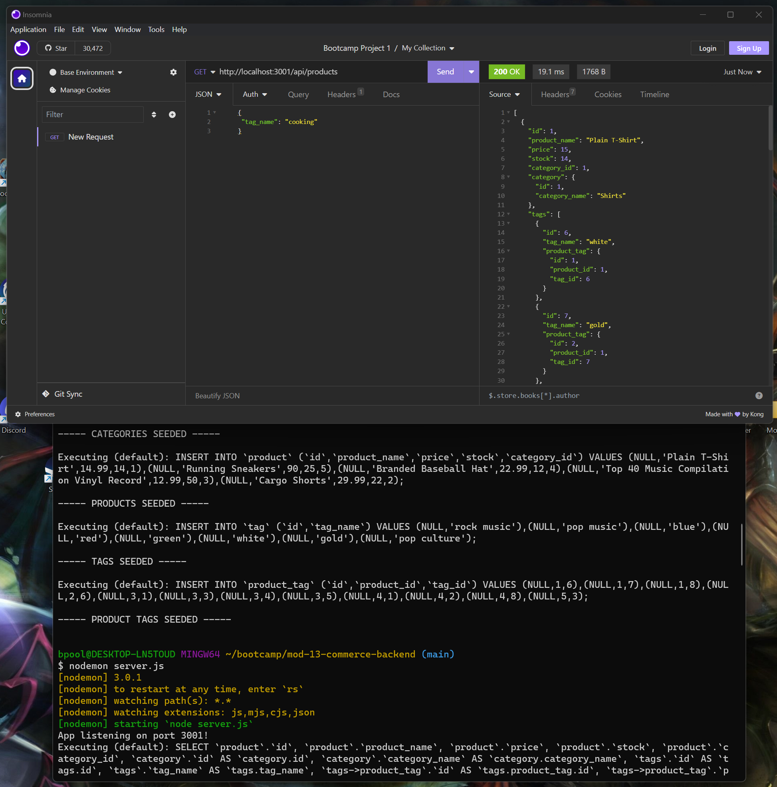

# Commerce Backend

## Video Demonstration
[A Functionality Walkthrough](https://www.youtube.com/watch?v=Ux4ZQIE8CRQ&ab_channel=BenPoole)

## Description
This is an application that gives a backend structure to a commerce database

## Source Code Used
Source code was provided as part of the bootcamp homework module.  The source code used can be found in the 2nd commit.

## Installation
Navigate to the root directory of the project.  Then type mysql -u root -p(your password).  Then type source ./db/schema.sql. After the database has been created type 'npm run seed' followed by 'npm run start'.
    
## Usage
The user is able to:  
GET all products, categories, and tags  
GET a single product, category, or tag  
POST a new product, category, or tag  
PUT in a replacement product, category, or tag based on id  
DELETE a product, category, or tag based on id
    
## Contribution Guidelines
N/A
    
## License
N/A
    
## Email Address
If you have any questions or concerns please reach out to me at bpoole53@gmail.com